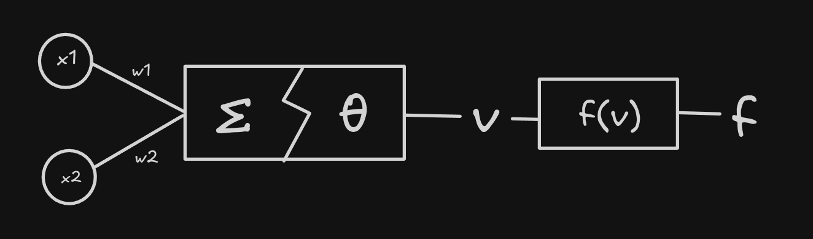
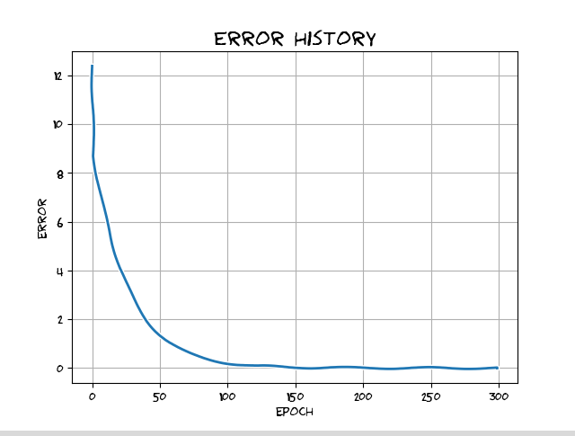
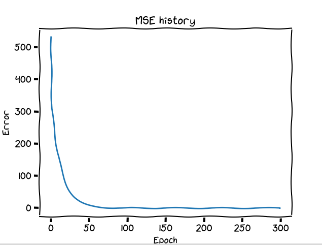
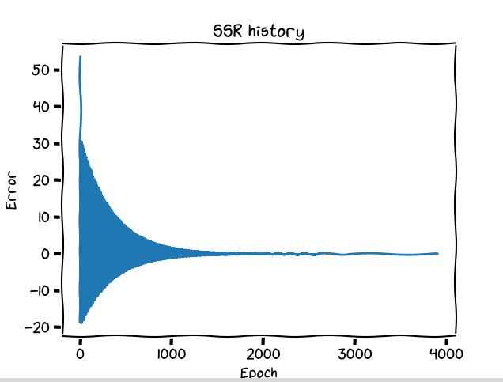

# 🧠 Perceptron monocapa


Un **perceptrón monocapa** es la unidad básica de una red neuronal, por lo tanto, en este proyecto abordaremos un análisis y el desarrollo experimental de herramientas que nos permitan evaluar su rendimiento y conocer fenómenos interesantes de manera práctica.

## 🏁 Introducción

El perceptrón monocapa tiene un increíble potencial, gracias a su capacidad de poder cuantificar la magnitud de los errores que este comete, y a base de esa magnitud, corregir sus errores.

Este contiene componentes muy útiles para tomar en cuenta, lo cual permite adecuarse y *amoldarse* a problemas para los cuales él no conoce.

## 🧬 Inspirado en la biología


Un percetrón fué creado basado en la forma biológica de nuestras neuronas, una neurona biológica tiene pequeñas conexiones que la permite comunicarse con otras neuronas, a esto se le conoce como las **conexiones sinápticas**, algo que en el mundo de los perceptrones las conocemos como **pesos sinápticos**.

# 📕 Acerca del proyecto

Este proyecto usa Poetry por detrás, para gestionar fácilmente el proyecto y sus dependencias con el objetivo de que sea fácil y rápido de probar este proyecto, por el cual, puedes probar el proyecto usando los siguientes comandos:

1. **Instalar poetry:** Instalar poetry es tan fácil como ejecutar el comando

```bash
pip install poetry
```

2. **Clonar el repositorio:** Ahora que tienes poetry, clona el repositorio actual para probarlo

```bash
git clone https://github.com/TechAtlasDev/perceptron-monocapa
```

Y entra al repositorio que acabas de clonar con el comando `cd perceptron-monocapa`

3. **Instalar las dependencias:** Este proyecto tiene dependencias que te permitirán visualizar el desempeño del perceptrón, puedes instalarlas con el comando:

```bash
poetry install
```

4. **Ejecutar el proyecto:** Ejecuta el proyecto con el comando:

```bash
poetry run linear
```

## 🧠 El perceptron

El perceptron que fué desarrollado desde 0 para hacer que este proyecto sea fácilmente de interpretar, personalizar y comprender.

Un perceptrón monocapa es la unidad básica de una red neuronal convencional, cuando vemos una representación gráfica de una red neuronal, podemos tomar en cuenta que cada *círculo* es un perceptrón, que tiene entradas y una salida.



🚀 ¡Comencemos analizando cada parte del perceptrón pero de una perspectiva más amigable!

### Datos de entrada

Los datos de entrada, ¡la raíz de donde todo inicia!, tenemos que buscar una manera de poder darle al perceptrón datos para que este pueda procesar.

Los datos de entrada nos permiten darle al perceptrón datos que tenga que tomar en cuenta, en la imagen podemos ver que son las variables `x1` y `x2`.

Estos datos tienen que ser procesados, se les tiene que asignar un *peso* (en la imagen podemos ver que es `w1` y `w2`) , este peso se les conoce como pesos sinápticos o **wheigts**, lo cual nos permite asignar una *"importancia"* a cada dato de entrada.

### Perceptrón

En el perceptrón podemos visualizar 

## Métricas

Usamos métricas para poder comprender el rendimiento del modelo, 







Artículo aún por terminar.

## Comportamiento

## Rendimiento

## Casos particulares