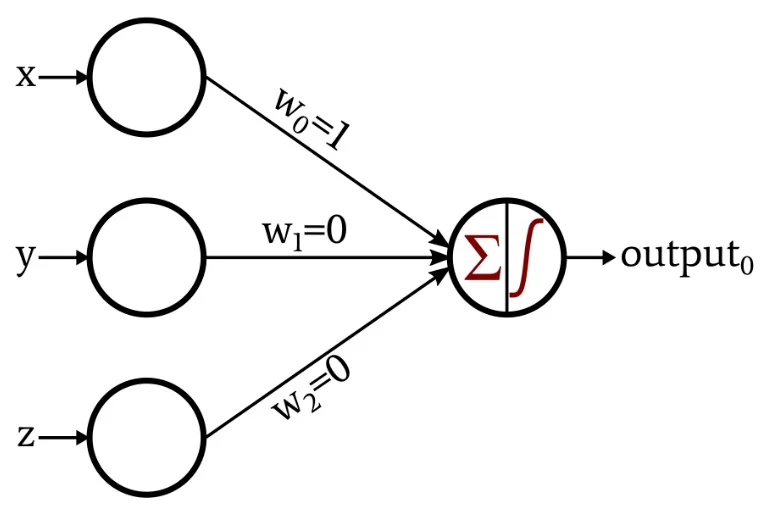
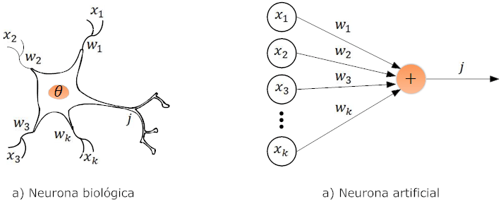

# 🧠 Perceptron monocapa

Un **perceptrón monocapa** es la unidad básica de una red neuronal, por lo tanto, en este proyecto abordaremos un análisis y el desarrollo experimental de herramientas que nos permitan evaluar su rendimiento y conocer fenómenos interesantes de manera práctica.

## 🏁 Introducción

El perceptrón monocapa tiene un increíble potencial, gracias a su capacidad de poder cuantificar la magnitud de los errores que este comete, y a base de esa magnitud, corregir sus errores.

Este contiene componentes muy útiles para tomar en cuenta, lo cual permite adecuarse y *amoldarse* a problemas para los cuales él no conoce.

## 🧬 Inspirado en la biología

Un percetrón fué creado basado en la forma biológica de nuestras neuronas, una neurona biológica tiene pequeñas conexiones que la permite comunicarse con otras neuronas, a esto se le conoce como las **conexiones sinápticas**, algo que en el mundo de los perceptrones las conocemos como **pesos y conexiones sinápticas**, las cuales podemos saber que pueden ser de:

  * **Caracter inhibidor**
  * **Caracter exitatorio**